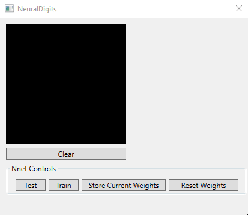

# NeuralDigits
A multilayer perceptron neural network for the MNIST digit database

This is a simple C# implementation of a MLP with a single hidden layer using a sigmoid activation function optimized via the conjugate gradient descent algorithm.

The UI was made with WPF controls and supports the following functions:
  - **Predict** - drawing on the canvas calls the feed forward 
  - **Clear** - clear the drawing canvas
  - **Test** - test the neural network's weights against the 10.000 image MNIST test set
  - **Train** - train a small neural network against a 5.000 image subset of the MNIST training set
  - **Store Current Weights** - save the current weights to file
  - **Reset Weights** reset the weights to the startup values

Although the training function is completely operational it is relatively slow and therefore serves for demonstration purposes.
Training limits the hidden layer to 5 neurons, 5000 training images and 10 iterations. 

The weights loaded on application startup were trained with scikit and python with a 300 neuron hidden layer, 60.000 training images and 50 iterations. The python script is provided in **trainnn.py**.

*Note: Requires the Accord.Math library for the conjugate gradient minimization function, get it from NuGet.
